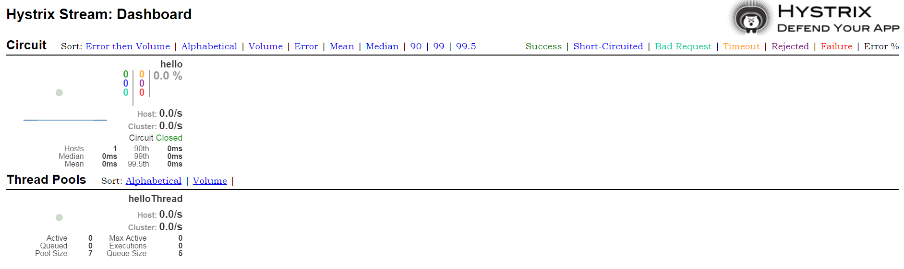

# Hystrix

**Hystrix** is a latency and fault tolerance library designed to isolate points of access to remote systems, services and 3rd party libraries, stop cascading failure and enable resilience in complex distributed systems where failure is inevitable.

Every point in an application that reaches out over the network or into a client library that might result in network requests is a source of potential failure. Worse than failures, these applications can also result in increased latencies between services, which backs up queues, threads, and other system resources causing even more cascading failures across the system.

What will happen to application when this external service has a problem?
Application will become unavailable. The screens of application will freeze and not respond as the external system doesn’t return with a response.

What should the application do, when the external service is unavailable?
1. Respond users with proper message.
2. Provide fall backs when the external service went down.
3. Hooks for monitoring to highlight the problematic service.
4. Prevent overloading of the problematic service.
6. Automatic recovery once the problematic service is online.

# Calculate Circuit Health
Hystrix reports successes, failures, rejections, and timeouts to the circuit breaker, which maintains a rolling set of counters that calculate statistics.

# Implementation steps
### Pre-requisites
- JDK
- Spring libraries/dependencies
- IDE(Any)
- Maven
#### Configure pom.xml to setup monitoring server using **Hystrix**
```sh
	<dependencies>
		<dependency>
			<groupId>org.springframework.boot</groupId>
			<artifactId>spring-boot-starter-actuator</artifactId>
		</dependency>
		<dependency>
			<groupId>org.springframework.cloud</groupId>
			<artifactId>spring-cloud-starter-hystrix-dashboard</artifactId>
		</dependency>

		<dependency>
			<groupId>org.springframework.boot</groupId>
			<artifactId>spring-boot-starter-test</artifactId>
			<scope>test</scope>
		</dependency>
		<dependency>
			<groupId>com.netflix.hystrix</groupId>
			<artifactId>hystrix-metrics-event-stream</artifactId>
		</dependency>
	</dependencies>
```
#### Configuring pom.xml for **Hystrix** in every Spring based rest service

```
		<dependency>
			<groupId>org.springframework.cloud</groupId>
			<artifactId>spring-cloud-starter-hystrix</artifactId>
		</dependency>
```

#### Annotate restful methods with Hystrix commands.
```
	@HystrixCommand(fallbackMethod="failOver", groupKey="Hello",
			commandKey="hello",
			threadPoolKey="helloThread"
			)
```
# Hystrix Dashboard view
[]